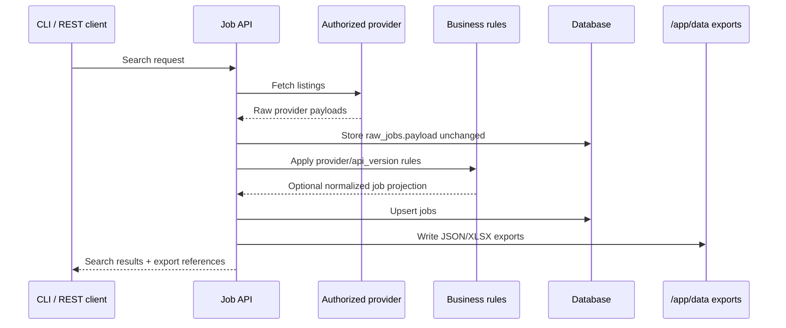
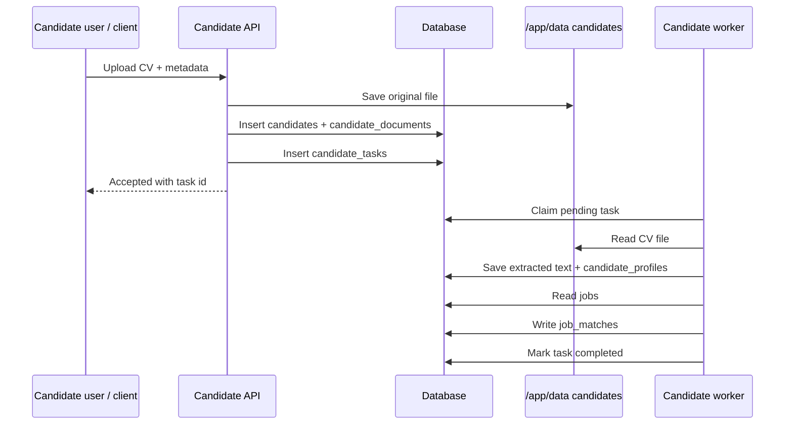

# Architecture

This repository contains two application domains:

- `app/`: job ingestion API, provider connectors, raw payload storage, and business-rule projection
- `candidate_service/`: CV intake API, parsing, matching, and background worker execution

The live queue path for candidate work is database-backed with `QUEUE_BACKEND=database`.
NATS is deployed for future event-driven workflows, but it is not the primary task transport today.

## Runtime Diagram

```mermaid
flowchart TB
    subgraph Clients
        U1[Operators / CLI]
        U2[Frontend or API Consumers]
        P[Authorized Job Providers]
    end

    subgraph Services
        API[Job API<br/>FastAPI<br/>app/]
        CAPI[Candidate API<br/>FastAPI<br/>candidate_service/]
        WORKER[Candidate Worker<br/>Background process<br/>candidate_service/worker.py]
        NATS[NATS + JetStream<br/>Future event bus]
    end

    subgraph Persistence
        DB[(PostgreSQL or SQLite<br/>SQLAlchemy shared database)]
        FILES[/Shared /app/data volume<br/>exports + candidate uploads/]
    end

    subgraph Database Tables
        RAW[raw_jobs]
        JOBS[jobs]
        CAND[candidates]
        CDOC[candidate_documents]
        CPROF[candidate_profiles]
        CTASK[candidate_tasks]
        MATCH[job_matches]
        APPS[job_applications]
    end

    U1 -->|search jobs / run exports| API
    U2 -->|upload CV / view matches| CAPI
    P -->|provider APIs / feeds| API

    API -->|fetch raw provider records| P
    API -->|store untouched payloads| RAW
    API -->|apply business rules| JOBS
    API -->|write export files| FILES

    CAPI -->|create candidate records| CAND
    CAPI -->|store document metadata| CDOC
    CAPI -->|save uploaded files| FILES
    CAPI -->|enqueue parse/match/apply tasks| CTASK

    WORKER -->|claim pending tasks| CTASK
    WORKER -->|read CV files| FILES
    WORKER -->|parse CVs| CPROF
    WORKER -->|read projected jobs| JOBS
    WORKER -->|write ranked matches| MATCH
    WORKER -->|persist provider applications| APPS

    DB --> RAW
    DB --> JOBS
    DB --> CAND
    DB --> CDOC
    DB --> CPROF
    DB --> CTASK
    DB --> MATCH
    DB --> APPS

    API -. configured but not primary path .-> NATS
    CAPI -. configured but not primary path .-> NATS
    WORKER -. configured but not primary path .-> NATS
```

## Main Flows

### 1. Job ingestion

### 2. Candidate submission and matching

## Deployment Shape

- `compose.yaml` runs `api`, `candidate-api`, `candidate-worker`, and `nats`
- Kubernetes manifests split those into separate deployments under `k8s/`
- All services share the same `DATABASE_URL`
- `candidate-api` and `candidate-worker` also share `/app/data` for uploaded documents
- In production, PostgreSQL is the intended backend; SQLite is mainly for local development

## Current Constraints

- Tables are created at startup with SQLAlchemy `create_all`, not migrations
- Candidate task coordination is safe for multi-worker production when using PostgreSQL because the worker claim path uses `FOR UPDATE SKIP LOCKED`
- NATS exists in the repo, but the active candidate workflow still runs through `candidate_tasks` in the database
